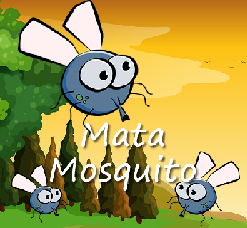
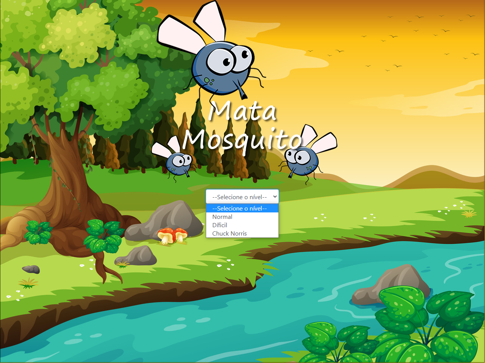

# Game Mata Mosquito
## Jogo criado utilizando html, css e javaScript
<h1 align="center">
  
</h1>

 <a href="#sobre-o-projeto">Sobre</a> •
 <a href="#funcionalidades">Funcionalidades</a> •
 <a href="#layout">Layout</a> • 
 <a href="#tecnologias">Tecnologias</a> • 

<h4 align="center"> 
	 Game Mata Mosquito 🕹️ Finalizado
</h4>

## 🕹️ Sobre o projeto

🕹️ O jogo mata mosquito foi criado com javaScript sendo um projeto desenvolvido durante o curso de Desenvolvimento Web ministrado pelo professor Jorge Sant' Ana.

Esse projeto foi desenvolvido para o estudo de implementação de conceitos básicos e introdutórios em javaScript, abordando temas como BOM com windows, screen, location, 
timing...
---

## ⚙Funcionalidades

-Basicamente o projeto consiste de três páginas html sendo uma responsável pelo jogo, uma para indicar que o jogador ganhou e outra para indicar que o jogador perdeu. 

-Támbem na tela principal do jogo também existe a possibilidade de alterar o nivel de dificuldade, onde basicamente será alterado no código o tempo em que o mosquito aparecera.
  - No nivel Normal a velocidade que aparecerá a cada 1500 milisegundos.
  - No nivel Dificil a velocidade que aparecerá a cada 1000 milisegundos.
  - No nivel Chuck Norris a velocidade que aparecerá a cada 750 milisegundos.

  Página seleção de dificuldade:
  
  Nesta página é possivel realizar a seleção da dificuldade do game.
  
  <h3>Seleção Dificuldade</h3>
  
  
  <h3>Hora de jogar</h3>
  
  -E como o jogo funciona, basicamente durante um periodo de tempo de certa de 10 segundo o jogador terá que matar todas os mosquitos que aparecer na tela de forma randomica alterando
  também não só a posição do mosquito mas também o tamanho do mesmo. Caso não consiga ele perderá seus pontos de vidas representado por 3 corações no canto inferior da tela.
  Caso ele sobreviva os tempo de 10 segundo mantendo seus pontos de vida o jogador irá vencer.
  
  
  ---

## 🎨Layout

O layout foi fornecido pelo professor 
[Jorge Sant' Ana](https://www.linkedin.com/in/jorgesantanabr/).

### 🛠Tecnologias

As seguintes ferramentas foram usadas na construção do projeto:

- [HTML](https://www.w3schools.com/html/default.asp)
- [CSS](https://www.w3schools.com/css/)
- [JS](https://developer.mozilla.org/pt-BR/docs/Web/JavaScript)
- [Bootstrap](https://getbootstrap.com/)
- [VisualStudio](https://visualstudio.microsoft.com/pt-br/)
